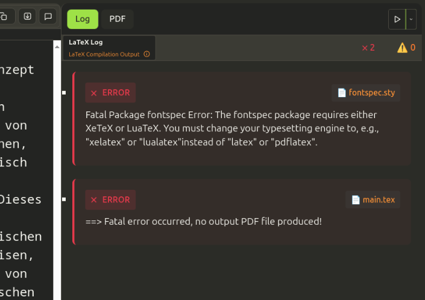

# TeXlyre

A **[local-first](https://www.inkandswitch.com/essay/local-first/)** real-time [LaTeX](https://www.latex-project.org/) and [Typst](https://typst.app) collaboration platform with offline editing capabilities. Built with React, TypeScript, and Yjs for collaborative document editing.

[](https://texlyre.github.io/texlyre)
[](https://github.com/texlyre/texlyre/actions)
[](https://github.com/texlyre/texlyre/actions)
[](https://crowdin.com/project/texlyre)
[](https://www.gnu.org/licenses/agpl-3.0)
[](https://www.typescriptlang.org/)
[](https://reactjs.org/)


## Features

### Real-time Collaboration

TeXlyre enables multi-user editing with live cursors and selections visible across all connected clients. The platform uses **[Yjs](https://github.com/yjs/yjs) CRDTs** for conflict-free synchronization, ensuring that changes from multiple users are automatically merged without conflicts. Communication happens through **WebRTC** peer-to-peer connections, providing low-latency collaboration without requiring a central server. An integrated chat system allows collaborators to communicate directly within the editing environment.

<p align="center">

</p>

TeXlyre provides comment and chat features for real-time exchanges, reviews, and discussions among collaborators.

<p align="center">

</p>

TeXlyre also includes an embedded diagram editor powered by [Draw.io](https://www.drawio.com/), enabling collaborators to create and edit diagrams in real-time directly within a project.

<p align="center">

</p>


### LaTeX Compilation

The platform integrates **[SwiftLaTeX](https://github.com/SwiftLaTeX/SwiftLaTeX) WASM engines** to provide in-browser LaTeX compilation without server dependencies. Currently supports **pdfTeX** and **XeTeX** engines for document processing. TeXlyre supports real-time syntax highlighting and error detection, with an integrated PDF viewer that offers zoom, navigation, and side-by-side editing capabilities.

<p align="center">

</p>

### Typst Compilation

The platform integrates **[typst.ts](https://github.com/Myriad-Dreamin/typst.ts)** to provide in-browser [Typst](https://github.com/typst/typst) compilation without server dependencies. Currently supports PDF, SVG, and canvas compilation, however, SVG and HTML compilation are experimental, and are not guaranteed to work as expected at the time being.  

<p align="center">

</p>

### Local-first Architecture

TeXlyre prioritizes data ownership and offline capability. All documents are stored locally using **IndexedDB**, enabling full offline editing with automatic synchronization when connectivity returns. The File System Access API provides direct folder synchronization for external backup solutions, while project export and import features ensure complete data portability across devices and installations.

### File Management and Synchronization

The platform includes a file explorer supporting drag-and-drop operations for various file types including LaTeX sources, Typst sources, images, and data files. **Document linking** creates connections between collaborative documents and static files, enabling seamless editing workflows. **[FilePizza](https://github.com/kern/filepizza) integration** provides secure peer-to-peer file sharing between collaborators, allowing large file transfers without intermediary servers.


### Editor Tools

TeXlyre includes editor-level tools designed to improve mathematical authoring and document quality. These tools operate entirely in the browser, work offline, and remain synchronized across collaborators in real time.

TeXlyre provides built-in document statistics to help authors track progress while writing. Word counts are computed using **[TeXcount](https://app.uio.no/ifi/texcount/)** for LaTeX documents and **[typst-wordometer](https://github.com/Jollywatt/typst-wordometer)** for Typst documents, delivering accurate statistics that reflect the structure of each language rather than raw text length.

<p align="center">
  
</p>

To maintain clean and readable source files, TeXlyre includes formatting tools for both LaTeX and Typst. LaTeX documents are formatted using **[tex-fmt](https://github.com/WGUNDERWOOD/tex-fmt)**, while Typst documents use **[typstyle](https://github.com/typstyle-rs/typstyle)**, applying consistent indentation and line separation without altering document semantics.

<p align="center">
  
</p>

Mathematical expressions can be edited interactively using inline previews powered by **[MathLive](https://github.com/arnog/mathlive)**. When hovering over or placing the cursor inside a math expression, TeXlyre renders the formula directly and allows it to be edited using the MathLive virtual keyboard, making equations easier to create and modify.

<p align="center">
  
</p>


## Quick Start


For detailed installation instructions, advanced configuration, and development workflows, see the [installation documentation](https://texlyre.github.io/docs/installation). 

For configuring TeXlyre's theme, properties, and supported plugins, see the [configuration documentation](https://texlyre.github.io/docs/configuration#configuration-files). 

Installation requires Node.js 20+ and a modern browser with File System Access API support:

```bash
git clone https://github.com/TeXlyre/texlyre.git
cd texlyre
npm install
npm run start
```

Navigate to `http://localhost:4173` to access the application. Create a new project to begin editing, or open an existing project by sharing its URL with collaborators. The URL format `http://localhost:4173/#yjs:abc123def456` enables instant collaboration access.

Moreover, you can start your project from a template and share the link with your collaborators.

<p align="center">

</p>

## Architecture

TeXlyre's architecture emphasizes **local-first principles** while enabling real-time collaboration. The React frontend communicates with Yjs documents stored in IndexedDB, providing offline-first functionality. WebRTC establishes direct peer connections for real-time synchronization, while **[SwiftLaTeX](https://github.com/SwiftLaTeX/SwiftLaTeX) WASM engines** and **[typst.ts](https://github.com/Myriad-Dreamin/typst.ts)** handle LaTeX and Typst compilation entirely in the browser.

The **plugin system** allows extensibility through custom viewers, renderers, and backup providers. Core plugins handle PDF rendering, Bibliography cleaning, LaTeX and Typst log visualization, an embedded Draw.io diagram editor with collaborative support, file system backups, and repository backups (GitHub, GitLab, Gitea, and Codeberg). Theme plugins also provide customizable layouts and visual styles.


## File Synchronization

### Local File System

The File System Access API enables direct synchronization with local folders, supporting cross-device workflows through cloud storage providers like Dropbox or Google Drive. Users can connect TeXlyre projects to existing file system structures, maintaining compatibility with traditional LaTeX and Typst workflows.

### Peer-to-peer Sharing

**[FilePizza](https://github.com/kern/filepizza) integration** facilitates secure file sharing between collaborators over WebRTC. Large files, images, and other non-collaborative text files can be transferred directly between browsers, maintaining privacy and reducing dependency on external services. This protocol, although completely independent of the Yjs WebRTC connection, still uses Yjs to manage file metadata and synchronization state, ensuring that all collaborators have access to the latest versions of shared files. Yjs facilitates real-time collaboration (e.g., live updates to file lists, shared metadata, cursor tracking, real-time document editing) while FilePizza handles the file transfer of non-collaborative files.

## Plugin Development

The plugin architecture supports custom functionality through typed interfaces:

```typescript
interface ViewerPlugin extends Plugin {
  type: 'viewer';
  canHandle: (fileType: string, mimeType?: string) => boolean;
  renderViewer: React.ComponentType<ViewerProps>;
}
```

Plugins can extend TeXlyre with custom file viewers, LaTeX/Typst log processors, backup providers, and theme variations (including a mobile theme). The plugin registry automatically discovers and loads compatible plugins during application initialization.

Once a plugin is developed, it can be registered in the `plugins.config.ts` by simply adding its path (excluding the '/extras' prefix). All plugins must be placed in the 'extras' directory to be recognized by the system. 

Configuration may be overriden by the `texlyre.config.ts` depending on your installation. **ALWAYS** set the plugin path as well in `texlyre.config.ts` for guaranteed persistence of the config (see the [configuration documentation](https://texlyre.github.io/docs/configuration#configuration-files))

## Browser Compatibility

TeXlyre requires modern browser features for optimal functionality. **Chrome and Edge** provide full feature support including File System Access API and WebRTC. **Firefox** supports core collaboration features but has limited file system integration. **Safari** offers partial compatibility with reduced file system access capabilities. The File System API was not thoroughly tested with mobile device browsers; therefore, use the file system backup feature on TeXlyre with caution.

WebRTC support is required for real-time collaboration, while the File System Access API enables backup and synchronization features in supported browsers.

## License

TeXlyre is licensed under the GNU Affero General Public License v3.0 (AGPL-3.0).

This means:
- ✅ You can use, modify, and distribute this software
- ✅ You can run it for any purpose, including commercial use
- ⚖️ If you distribute modified versions, you must also distribute the source code
- ⚖️ If you run a modified version as a network service, you must provide source code to users

See [LICENSE](LICENSE) for the complete license text.

### Why AGPL-3.0?

TeXlyre is licensed under AGPL-3.0 due to our dependency on [SwiftLaTeX's AGPL-licensed LaTeX engine (WASM)](https://github.com/SwiftLaTeX/SwiftLaTeX/) for in-browser LaTeX compilation.

## Privacy & Data

TeXlyre is privacy-focused by design:

- **Local-first**: All your data stays in your browser
- **Direct connections**: Peer-to-peer collaboration without server intermediaries  
- **No tracking**: No analytics, cookies, or data collection

When you collaborate, IP addresses are temporarily processed through signaling servers to establish direct connections. No project content is transmitted through our servers.

### Repository Backup Integration
The optional GitHub, GitLab, Gitea, and Forgejo (Codeberg) integration only activates when you explicitly enable them and provide your own token.

## Infrastructure

TeXlyre uses open source signaling servers for WebRTC connections:

- **Y-WebRTC Signaling**: Based on [y-webrtc](https://github.com/yjs/y-webrtc)
- **PeerJS Signaling**: Based on [PeerJS Server](https://github.com/peers/peerjs-server)
- **TeX Live Download Server**: Based on [SwiftLaTeX Texlive On-Demand Server](https://github.com/SwiftLaTeX/Texlive-Ondemand)
- **FilePizza Server**: Based on [FilePizza](https://github.com/kern/filepizza) which relies on PeerJS (built-in TURN containers are not deployed on TeXlyre servers)

All servers are hosted locally and made publicly available with [Cloudflare Tunnel](https://developers.cloudflare.com/cloudflare-one/connections/connect-networks/).

### Self-Hosting

You can run your own signaling servers by following the setup instructions in our [infrastructure repository](https://github.com/texlyre/texlyre-infrastructure).

## Acknowledgments

TeXlyre builds upon several key technologies:

### Core Technologies
- **[SwiftLaTeX](https://github.com/SwiftLaTeX/SwiftLaTeX)** - WASM-based LaTeX compilation engine
- **[typst.ts](https://github.com/Myriad-Dreamin/typst.ts)** - WASM-based Typst compilation engine
- **[Yjs](https://github.com/yjs/yjs)** - Conflict-free collaborative editing with CRDTs
- **[CodeMirror](https://codemirror.net/)** - Extensible code editor
- **[PDF.js](https://github.com/mozilla/pdf.js)** - PDF rendering in JavaScript
- **[FilePizza](https://github.com/kern/filepizza)** - Secure peer-to-peer file transfers

### Editor Extensions
- **[codemirror-vim](https://github.com/replit/codemirror-vim)** - Vim keybindings for CodeMirror
- **[codemirror-lang-typst](https://github.com/kxxt/codemirror-lang-typst)** - Typst language support for CodeMirror
- **[codemirror-toolbar](https://github.com/yeliex/codemirror-extensions)** - Extensible toolbar for CodeMirror

### LaTeX Tools
- **[tex-fmt](https://github.com/WGUNDERWOOD/tex-fmt)** - LaTeX code formatter
- **[TeXcount](https://app.uio.no/ifi/texcount/)** - Word counter for LaTeX documents
- **[BibTeX-Tidy](https://github.com/FlamingTempura/bibtex-tidy)** - BibTeX file cleaner and formatter

### Typst Tools
- **[typstyle](https://github.com/typstyle-rs/typstyle)** - Typst code formatter
- **[typst-wordometer](https://github.com/Jollywatt/typst-wordometer)** - Word counter for Typst documents

### Diagram & Visualization
- **[Draw.io](https://github.com/jgraph/drawio)** - Diagramming tool for collaborative diagram editing
- **[MathLive](https://github.com/arnog/mathlive)** - Math rendering and full editing with built-in symbol and expression keyboard

### Runtime
- **[WebPerl](https://github.com/haukex/webperl)** - Perl interpreter compiled to WebAssembly
- **[wasm-bindgen](https://github.com/wasm-bindgen/wasm-bindgen)** - Rust/Wasm interoperability

Development of TeXlyre was assisted by **Anthropic Claude** for debugging and architectural guidance.

---

**Ready to start collaborating?** 
[Get started with TeXlyre](https://texlyre.github.io/texlyre/) 
**or** 
[contribute to the project with bug fixes, new features, plugins, and translations](CONTRIBUTING.md).
